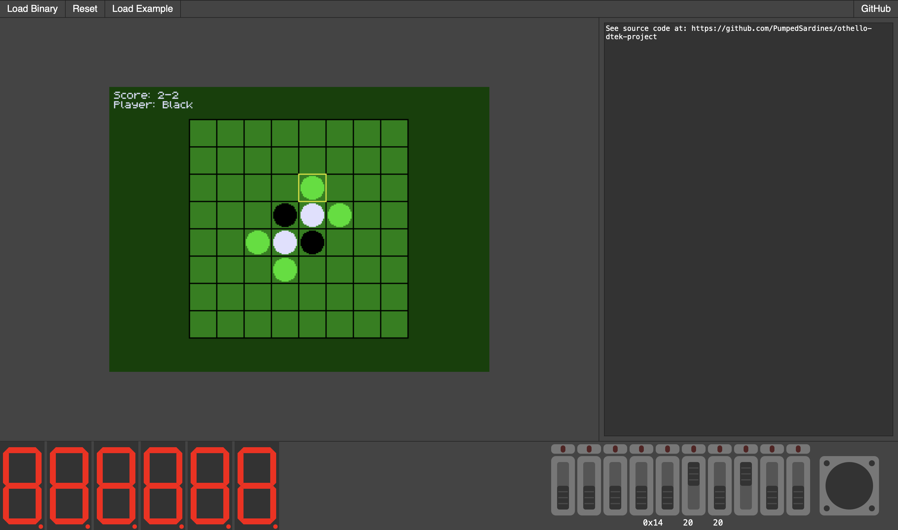

    <h1>DTEK-V emulator</h1>
    
An emulator for the DTEK-V chip, made for students enrolled in the IS1500 course at KTH

    <b><a href="https://dtekv.fritiof.dev">See it Live!</a></b>

 

## Supported IO devices:

- Button
- Switch
- Timer
- LED strip
- VGA output
- Hex displays
- Button interrupts
- Switch interrupts
- Timer interrupts

## Supported Instructions

[See the core module](https://github.com/PumpedSardines/dtekv-emulator-core)
